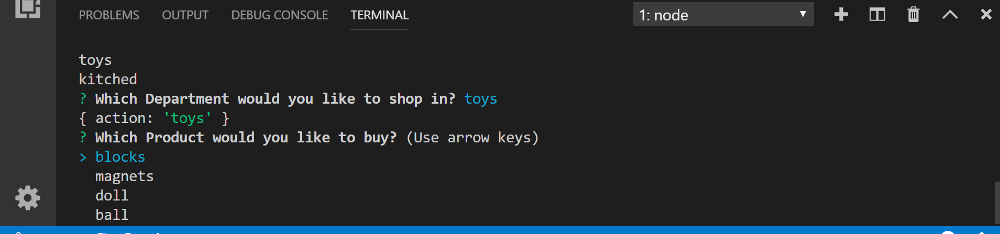
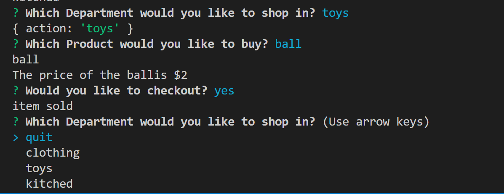

# bamazon
Bamazon is a mock store using a MYSQL database to track inventory. The data is SQL includes 14 products in 3 departments. 

## Installation

Use node enviroment to run the javascript file. You will need to install fs and mysql node packages with the following command. 

```bash
  npm install fs mysql
```

## Usage


1) The user will first be asked to chose which department to shop in. 
If more departments are added the code will adjust for that.  The user also has an option to quit shopping 


2) The user will then see a list of products from the department they chose.
If more products are added they code will adjust for that. 




3) When the user choses the product they will be shown the price of the product and asked if they would like to check out. 


4) When the user chosses to check out the program will loop them back to the first question, asking which department to shop in as well as an option to quit. 


5) This is the entire process for purchasing a ball from the toy department. 



6) These images show the MYSQL data before and after the ball in purchased.  The quantity of the balls drops from 30 to 29.
###Before

###After


7) When the user choses no at the checkout the program will end and display"done shopping'
### Chose No


### Done Shopping


Example Output after customer puchases a microwave and then exits the program

```bash
$ node bamazoncustomer.js
dept log:quit
kitched
? Which Department would you like to shop in? kitched
{ action: 'kitched' }
? Which Product would you like to buy? microwave
microwave
The price of the microwaveis $38
? Would you like to checkout? yes
item sold
? Which Department would you like to shop in? quit
{ action: 'quit' }
done shopping
```

## Contributing
Pull requests are welcome. For major changes, please open an issue first to discuss what you would like to change.

Please make sure to update tests as appropriate.

## License
[MIT](https://choosealicense.com/licenses/mit/)